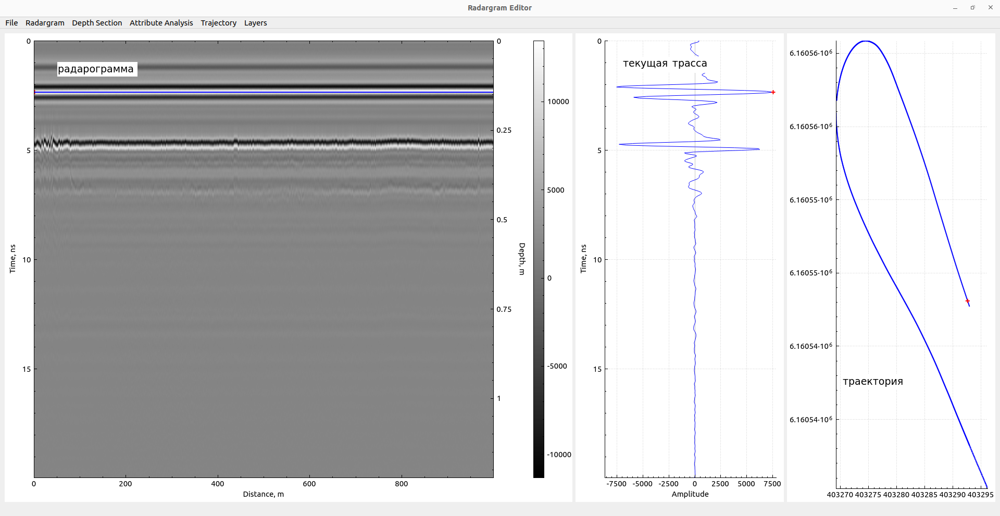

# Дипломный проект к курсу C++ Otus

## О программе

Приложение предназначено для обработки радарограмм - результатов георадарного обследования. 
[Подробнее про метод георадиолокации](https://geotim.ru/o-georadiolokacii/osnovy-georadiolokacii/)

## Примеры исходных данных

- Исходная радарограмма: `data/example.gpr2`
- Траектория движения георадара: `data/trajectory.csv`

## Возможности

- Импорт исходных радарограмм из данных георадара ОКО-2 (gpr2)
- Предварительная обработка радарограмм:
  - отражение
  - удаление сбойных трасс
  - обрезка
  - удаление прямой воздушной волны
- Преобразование из временного в глубинный разрез
- Атрибутный анализ
  - Расчет энергии
  - Расчет мгновенной фазы (cosine phase)
- Импорт траектории движения георадара по данным GPS-приемника
- Отрисовка слоев (пока только горизонтальных)
- Экспорт результатов обработки радарограммы (слоев границ) в CSV

## Интерфейс

